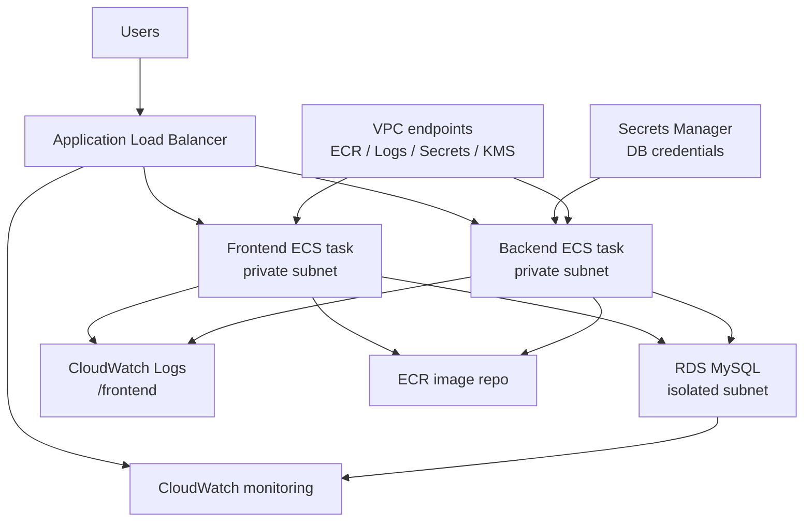
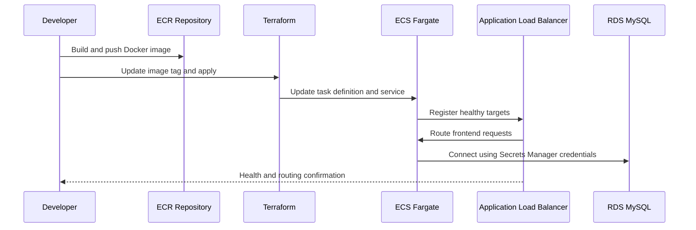

# Architecture

## ECS Fargate Production Deployment

## Design Choices

- The VPC spans two availability zones for resilience and complete private networking.
- Public subnets host the ALB and internet-facing entry point.
- Private application subnets host ECS Fargate tasks for the frontend and backend.
- Isolated database subnets host the RDS instance to limit direct access.
- Security groups restrict ALB ingress, frontend-to-backend traffic, and database connectivity to required paths only.
- AWS Secrets Manager stores the database password instead of injecting plaintext credentials into container environment variables.
- VPC endpoints keep private tasks connected to ECR, CloudWatch Logs, Secrets Manager, and KMS without NAT gateways.
- ECS task definitions use exact ECR image tags so deployments remain stable and traceable.

## Deployment Flow

