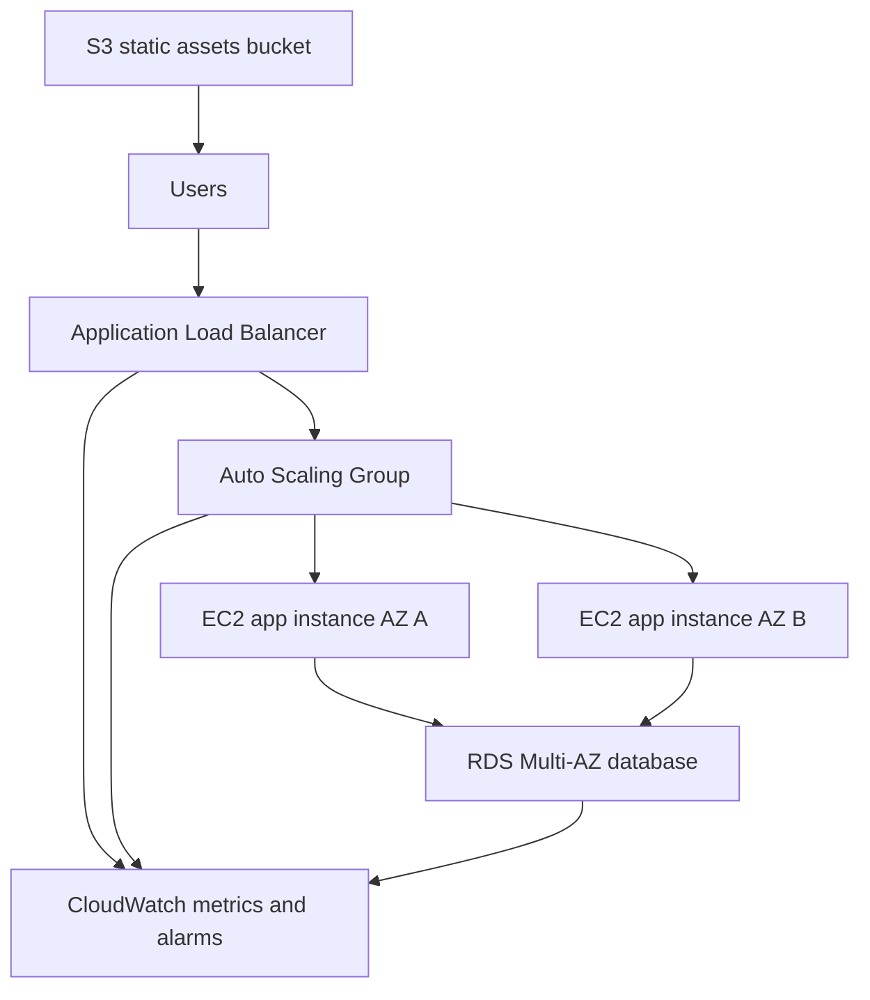
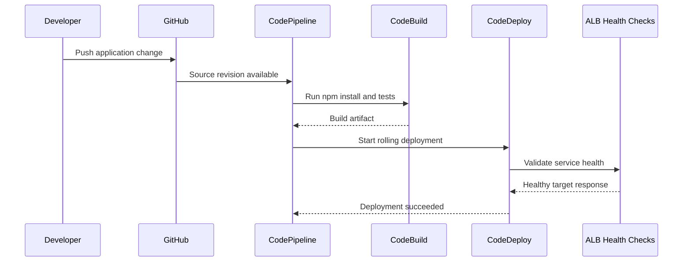

# Architecture

## Production-Style AWS Project

## Design Choices

- The VPC spans two availability zones to tolerate an AZ-level failure.
- Public subnets host the ALB and NAT gateways.
- Private application subnets host EC2 instances.
- Isolated database subnets host RDS.
- Security groups allow HTTP from the internet to the ALB, application traffic from the ALB to EC2, and database traffic from EC2 to RDS.
- Auto Scaling policies scale out near 70 percent CPU and scale in near 40 percent CPU.
- CloudWatch alarms surface unhealthy targets, high CPU, and database pressure.

## CI/CD Flow

